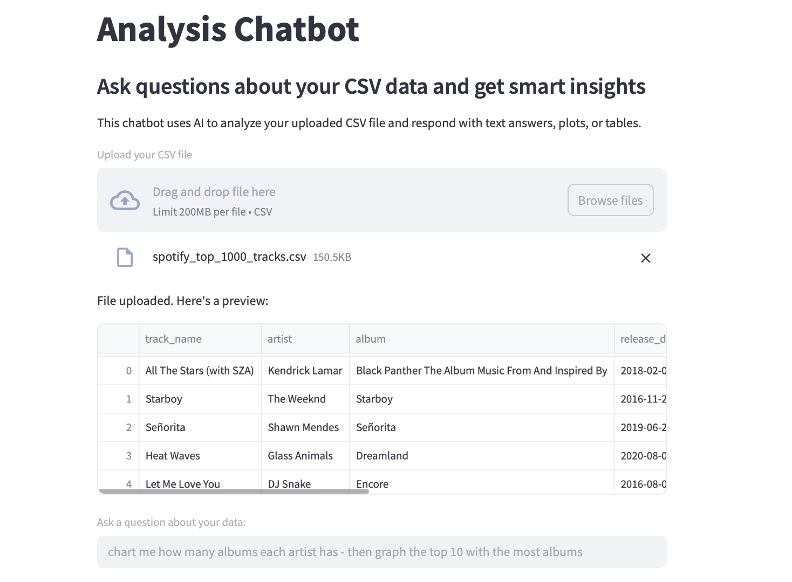

# Chatbot de Análisis de Datos

Este proyecto es un **chatbot inteligente de análisis de CSV** desarrollado con LangChain, OpenAI y Streamlit. Permite a los usuarios subir cualquier archivo CSV e interactuar con sus datos mediante lenguaje natural. La aplicación genera y ejecuta automáticamente código en Python con Pandas y Matplotlib para responder preguntas, mostrar tablas y generar gráficos.



---

## Funcionalidades

- Subida de archivos `.csv`
- Consultas en lenguaje natural como:
  - "¿Qué artista es el más popular?"
  - "Muestra la duración total de canciones por álbum."
  - "Grafica los 10 artistas con más álbumes."
- Generación automática de:
  - Código Python con **LangChain + GPT-4**
  - Tablas de resultados y **visualizaciones**
  - Ejecución en tiempo real con Pandas y Matplotlib

---

## Estructura del Proyecto

| Archivo | Descripción |
|---------|-------------|
| `attrition-analysis.py` | Script principal de la aplicación en Streamlit |
| `demo_1.png` | Captura de la interfaz de subida y preguntas |
| `demo_2.png` | Resultado en tabla generado por el modelo |
| `demo_3.png` | Gráfico de barras con artistas principales |
| `README.md` | Este archivo de documentación |

---

## Cómo Ejecutar el Proyecto

### Requisitos Previos

- Python 3.9 o superior
- Clave API de OpenAI
- Archivo `.env` con el siguiente contenido:

```env
OPENAI_API_KEY=tu_clave_api_aquí
```

### Instalación de Dependencias

```bash
pip install -r requirements.txt
```

#### `requirements.txt`

```text
streamlit>=1.30.0
pandas>=2.1.0
matplotlib>=3.8.0
langchain>=0.1.14
langchain-openai>=0.0.6
python-dotenv>=1.0.1
openai>=1.17.0
```

---

## Ejecución de la Aplicación

```bash
streamlit run attrition-analysis.py
```

Abre el navegador en: `http://localhost:8501`

---

## Descripción Técnica del Código

### 1. Inicialización del Modelo

```python
load_dotenv()
llm = OpenAI(temperature=0)
```

Carga las variables del entorno y configura GPT-4 (vía LangChain) con temperatura 0 para respuestas deterministas.

---

### 2. Subida del CSV

```python
uploaded_file = st.file_uploader("Upload your CSV file", type=["csv"])
df = pd.read_csv(uploaded_file)
st.dataframe(df.head())
```

El usuario carga su archivo y se muestra una vista previa de los datos.

---

### 3. Entrada de Preguntas

```python
user_question = st.text_input("Ask a question about your data:")
```

El usuario formula preguntas como:
> *"¿Qué álbum fue reproducido más minutos?"*

---

### 4. Generación de Código con LLM

```python
code = generate_analysis_code(user_question, df.head().to_string())
```

LangChain envía un prompt a GPT-4 incluyendo la estructura del DataFrame para generar código en Pandas.

#### Prompt Interno:
```
Usa el DataFrame `df` (ya cargado). No vuelvas a leer el CSV.
Muestra resultados usando `print(...)` o asigna tablas a `result`.
Si generas gráficos, utiliza `plt` (ya importado).
```

---

### 5. Ejecución del Código

```python
exec_globals = {"df": df, "plt": plt}
exec(code, exec_globals)
```

- Se captura la salida del `print()` usando `contextlib`
- Se muestran las tablas si existe la variable `result`
- Se renderiza el gráfico si hay figuras activas con `matplotlib`

---

### 6. Visualización de Resultados

```python
if "result" in exec_globals:
    st.dataframe(exec_globals["result"].head())

if plt.get_fignums():
    st.pyplot(plt.gcf())
```

---

## Capturas de Pantalla

### Interfaz de Subida + Pregunta


---

### Resultado en Tabla


---

### Visualización Gráfica


---

## Consideración de Seguridad

> ⚠️ **Aviso**: Esta demo ejecuta código generado por IA usando `exec()`. No se recomienda usar en producción sin un entorno aislado o validación adicional.

---

## Autor

Desarrollado por **David Pineda** — herramientas impulsadas por IA para análisis de datos más inteligentes.  
Explorando el potencial de LangChain y LLMs aplicados a entornos reales.

---

